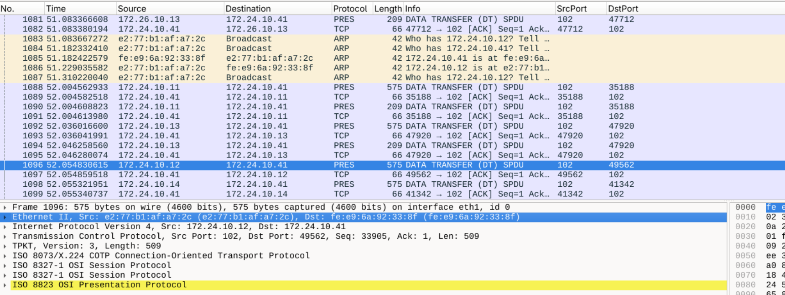

# POWER

One of the challenge groups provided by the CISS CTF was related to power systems. The setup was based on the IEC-61850 MMS and GOOSE protocols. 

## The Healing Chamber's Control Crystal

*Among the Programmable Logic Controllers (PLCs) that govern the mystical energy systems within the Houses of Healing Grid, locate the one with the highest IP address.*

The first challenge provided us with a PCAP file and the request to find the highest IP address for the "House of Healing GRID". After some analysis in the communication flow we came up with the following table that grouped the communication flow. For analysis of the PCAP files in the challenge we used [Skunkworks Network Analyzer](https://www.otb-consultingservices.com/brainpower/shop/skunkworks-network-analyzer/), which is a fork of Wireshark and a great tool for analyzing ICS network traffic and protocols like GOOSE and MMS, as it comes with preinstalled support to parse the body of such packet frames.


This is the list of endpoints as WireShark provided us with. Enriched with notes on which endpoint communicated with each other. So we figured the highest IP is the **172.100.0.18** which was wrong. Looking at the communication flow we figured, that this IP might be an HMI because every endpoint except the *.41 IPs send information to it. Therefor it might not be an IED as specified in the challenge.

Next we tried **172.26.20.41** which was also wrong. Looking at the flow again we could see that the IPs 172.26.20.0/24 send information to this IP. So it might be that they are an PLC controling the IEDs. So we tried **172.26.20.16** which was also wrong.

At this point we felt a bit stuck and decided to look at the next challenge, which proved to be very helpful as it provided us with the following plot: 


This is also super helpful for the first challenge, especially as we now know that the network segments are named, and there is a specific segment we were asked about: the "House of Healing". With this plot we were able to map the network segments to the IPs we found in the first challenge and identified the correct IP as **172.24.10.14**. 

**CISS25{172.24.10.14}**

## The Industrial Power Guardians of Stone Street Nexus

*Your Mission: Find the IP addresses of the IEDs that control the circuit breakers protect the industrial mystical loads in the Stone Street Nexus. Look at the network traffic to look for this IED. Please submit the highest IP address based on your discovery.*

With this information it was also easy to identify the second IP asked for, the Industrial loads in the "Stone Street Nexus" which was the **172.26.10.15**

**CISS25{172.26.10.15}**

## The Reconnaissance of the Luminous Spire

*Task - Mystical Device Location: Identify the ethereal addresses (IP addresses) of the IED in the Artisan's Quarter Grid. Locate the one with the highest IP address.*

Also, the next challenge was easy to solve, as we were asked to identify the highest IP address in the "Artisan's Quarter Grid", which is **172.26.20.16**.

**CISS25{172.26.20.16}**

## The Mystical Energy Audit of Stone Street Nexus

The next challenge was more tricky again. 
    
*Your Mission: Execute targeted mystical queries against the Intelligent Energy Distributors within the Stone Street Nexus (DS2 substation) to extract critical power measurement data from the industrial sector. This investigation will demonstrate how an Enemy agent might gather intelligence about our energy systems or how our defenders can monitor system health.*

*Task - Industrial Power Analysis: Using the IEC61850 MMS protocol, send targeted queries to the relevant IEDs controlling the Stone Street Nexus substation to determine the precise real power consumption at the mystical energy bus that feeds the industrial manufacturing operations. (4 digits percision)*

So we knew our target was the **172.26.10.15** IP address and now we had to find appropriate tooling to query the IED. This proved challanging, as the setup involved tunneling into the infrastructure over several Jump systems to reach the systems that allowed us to access the IED. This ment we had to download and migrate all the tools my hand to the target system and cloud not simply install them via the registry.

Our target system was an Alpine Linux 3.20 container. To install tools like `tcpdump` or `nmap`, we used the following Docker command to download all the resources with the needed dependencies.

```bash
docker run --rm \
  -v /tmp/alpine_offline_packages/nmap:/alpine_packages \
  alpine:3.20 \
  sh -c "apk update && apk fetch --recursive nmap --output /alpine_packages/"
4:29 PM
```

also we setup a SSH config for tunneling into the systems more easily. One mistake here was using an SSH key with a passphrase, which required us to enter it multiple times for each jump whenever we opened a new SSH connection or copied a file via SCP:

```
Host ciss-power
        HostName 200.200.200.200
        User iarcs
        Port 2222
        IdentityFile ~/.ssh/Key
        ProxyJump ciss

Host ciss-jump
        HostName users.ncl.sg
        User cissrt37
        IdentityFile ~/.ssh/Key

Host ciss
        HostName x3550.ddns.comp.nus.edu.sg
        User cissrt37
        Port 4637
        IdentityFile ~/.ssh/Key
        ProxyJump ciss-jump
```

However, while nmap was good for scanning, and tcpdump allowed us to capture traffic comming from the **172.26.10.11** showing us GOOSE messages, we needed a tool that allowed us to query the IED directly. We first tried to use the libiec61850 c library and its python bindings, but this did not work out for us as the library was hard to build on the Alpine Linux system, an then we still would have to implement an script to query the IED.

So we looked for other tooling with more of a focus on analytics tools and encountered the [IED Explorer](https://sourceforge.net/projects/iedexplorer/), a Windows tool hosted on SourceForge. Not our favorite place to obtain resources from, and also a .NET Windows tool, but we were desperate and tried it anyway, and it worked out quite well. We used a windows 10 VM to run the tool on and connected via the following ssh tunnel to the IED:

`ssh -L 10102:172.26.10.11:102 -J cissrt37@users.ncl.sg,cissrt37@x3550.ddns.comp.nus.edu.sg:4637 iarcs@200.200.200.200 -p 2222 -i ./key`

The IED Explorer lookes like follows (Unfortunately i now see that this screenshot is of the wrong IED CB1 and not the target CB5). After a conversation with Google Gemini about how naming conventions work in the IEC-61850 standard we figured that the value we were looking for is the `MMUX1.TotW.mag.f` which was exactly 1.0000.


**CISS25{1.0000}**

## Pinpointing the Moment of Infiltration

*As part of your forensic investigation into the Houses of Healing Grid crisis, you must identify the precise moment when the Enemy's mystical interception attack began.*

*Your Mission: Through careful examination of the Logic Crystal's specific network traffic archive (CHL5.2.pcap), determine exactly when the first corrupted MMS packet was injected by the Enemy agents during their mystical man-in-the-middle attack.*

*Forensic Challenge: The attackers positioned themselves between legitimate mystical devices to intercept and manipulate the sacred communication protocols. By identifying the first manipulated packet, you can establish: The exact timing of the attack initiation
The duration of the Enemy's control over the communication channel
The scope of potentially compromised mystical transmissions
The attack progression and escalation patterns
Submit: CISS25{Packet Number}*

#### Initial Recon

The evidence provided included:

* `CHL5.2.pcap` — a network traffic capture of the grid’s communication.
* `CHL5.csv` — a tabular log with timestamps and status flags.

The pcap showed Ethernet traffic containing MMS, GOOSE and ARP messages.

As the challenge already mentioned a Man-in-the-Middle attack, we suspected that we might see an ARP spoofing attack, as it is one of the most common techniques used in such scenarios. We recently discussed this in our [paper on the Eenergy25 conference in Rotterdam](https://doi.org/10.1145/3679240.3734647) where we also show that ARP spoofing is often discussed in related work as a Man-in-the-Middle attack vector.

#### Breakthrough — MAC Anomaly

While structural integrity checks didn’t show obvious MMS BER corruption, deeper flow inspection revealed a crucial clue:

In the packages 1083 - 1087 we can see that `e2:77:b1:af:a7:2c` starts spoofing the IP using a Broadcast ARP request to ask Who is 172.24.10.12 and then responds itself that it is `e2:77:b1:af:a7:2c` which is the first sign of the attack.
For IP `172.24.10.12`, the legitimate source MAC was consistent (`da:b8:a8:ed:57:7a`) until **packet 1096**, where it suddenly switched to `e2:77:b1:af:a7:2c`.
The IP remained the same, but the source MAC changed — a clear MITM indicator.
This means the attacker began injecting or modifying packets under a trusted IP identity at **packet 1096**.



Also, the timestamp aligns with the expected attack window from the CSV log. Other possible corruption checks (TPKT length mismatch, ASN.1 overflow) didn’t yield a clearer candidate.  No earlier MAC spoof events were detected — confirming **packet 1096** as the first sign of the Enemy’s mystical interception.

**CISS25{1096}**

## The Circuit Breaker Manipulation of Stone Street Nexus

*As an elite Red Guard defender conducting advanced penetration testing of the Luminous Spire's protective systems, you must demonstrate how Enemy agents could exploit the sacred IEC61850 mystical communication protocols to manipulate critical power infrastructure. This sophisticated attack will test your understanding of circuit barrier control and its cascading effects throughout the energy network.*

*Your Mission: Execute a precision attack against the Stone Street Nexus (DS2 substation) power distribution system by exploiting the mystical communication protocols that govern the circuit protection breakers. This mission will demonstrate how sophisticated attackers could manipulate industrial power systems through protocol exploitation.*

*Target the mystical circuit breaker connected to the industrial manufacturing operations (CB5) within the Stone Street Nexus and execute the following sequence:*

- *Opening Phase: Exploit the IEC61850 mystical messaging protocol to force the industrial circuit breaker (CB5) to open, cutting power to the critical weapon forges and manufacturing enchantments*
- *Monitoring Phase: While the breaker remains open, measure the cascading effects on the mystical energy transformer that feeds the sector*
- *Restoration Phase: Close the same circuit breaker to restore power flow, demonstrating complete control over the industrial power systems*

*Critical Measurement: During the opening phase when CB5 is forced open, you must precisely measure the line current flowing through the secondary side (low voltage) of the mystical energy transformer (CB2) that serves the Stone Street Nexus. This measurement will reveal how the industrial load disconnection affects the overall power distribution balance.*

Using the IED Explorer we were able to open the CB5 circuit breaker and then measure the current flowing through the secondary side of the transformer CB2. Important to know is again the right address of the control signal that is to be sent using the IEC 61850 MMS protocol. The `XCBR1.Pos` is the cirquit breaker controler. The ctlModel describes the default setting as described by the SCL file that sets the default configuration of the IED. What we need is the active in `XCBR1.Pos.Oper.ctlVal` that allows to activate and deactivate the circuit breaker.


Now we can connect IED Explorer to the CB2 in the Stone Street Nexus and query the current flowing through the secondary side of the transformer. The value we got was **0.0094**. Important, we now don't look at the total power in `MMUX1.TotW.mag.f` but at the current in `MMUX1.A.phsA.cVal.mag.f` which is the current flowing through the secondary side of the transformer CB2. As each phase has the same current flow it does not matter which phase we look at.


**CISS25{0.0094}**

## The Mysteries of the Load Shedding Enchantments

*As an elite Red Guard defender conducting advanced analysis of the Luminous Spire's protective systems, you must penetrate the secrets of the automated control logic that governs emergency load management within Rath Celen Ward. This mission requires sophisticated reverse engineering of the PLCs that protect our power grid during crisis conditions.*

*Your Mission: The PLC stationed within Rath Celen Ward contains ancient protective enchantments known as "load shedding logic" - mystical algorithms designed to automatically disconnect non-essential power consumers when the energy flow drops to dangerously low levels. Understanding these protective thresholds is crucial for both defensive planning and potential vulnerability assessment.*

*The Challenge: During siege conditions or infrastructure attacks, certain sectors of Minas Tirith may experience under-voltage situations that threaten critical systems. The PLC in Rath Celen Ward monitors energy levels and automatically sacrifices less critical loads to preserve power for essential defenses. However, the exact triggering thresholds of these protective enchantments remain a closely guarded secret.*

*Threshold Discovery: Through careful analysis of the mystical communication protocols and PLC behavior, determine the precise voltage threshold at which the load shedding enchantments activate. You must identify the largest voltage value that still triggers the protective load disconnection sequence.*

*Submit: CISS25{precise voltage threshold in p.u. (two decimal places)}*

To solve this challenge we had to analyze the PLC logic and the communication flow. A nmap scan of the system revealed that the ports 102, 502, 8080 and 20000 are open which hints at the protocols IEC 61850 MMS, Modbus, HTTP and DNP3. Using our setup with IED Explorer we were able to connect to the PLC and query all values which were quite comprehensive but also a bit overwhelming. We figured after some trials that this values don't expose the control logic that would be implemented as some form of code in the PLC. So instead we looked at the 8080 interface, which revealed a web interface of an OpenPLC which was configured with default credentials `openplc` and `openplc`. This allowed us to access the PLC web UI. The web UI allows the execution of custom code in the PLC, which can be used to open a reverse shell to the PLC as described in the following Github project: [OpenPLC Reverse Shell](https://github.com/machevalia/OpenPLC-CVE-2021-31630-RCE/blob/main/OpenPLC_CVE_2021_31630.py)

With this we were able to access the PLC which was a Ubuntu Docker Container. In the directory `/OpenPLC61850/` we can find the OpenPLC setup with a handy readme.md which explained us to look at the `/OpenPLC61850/webserver/st_files` directory for the code that is executed by the PLC. There we find a file called `DS3PLC.st` which contains the PLC code. Here we find the following configuration snippet:

```
  END_VAR
  VAR
    Alarmvalue : REAL := 0.995;
    Tripvalue : REAL := 0.890;
    Open : BOOL := false;
    Closed : BOOL := true;
    Overcurrent : REAL := 1.5;
    timerCounter: INT := 0;
    lsTimerStarted : BOOL := false;
    cpTimerStarted : BOOL := false;
    lsTimer: TON;
    cpTimer: TON;
  END_VAR
```

There we see an Alarmvalue and a Tripvalue. It’s important to know that the default value for the voltage is 1.0 p.u. If it drops below the Alarmvalue of 0.995 p.u., it will alert the operator but not disconnect any loads. If it drops below the Tripvalue of 0.890 p.u., it will disconnect all loads. So we can conclude that the voltage threshold at which the load shedding enchantments activate is **0.89 p.u.**, which is actually wrong, as the load shedding will be activated below this value, so we have to submit the value **0.88 p.u.** as the largest voltage value that still triggers the protective load disconnection sequence.

**CISS25{0.88}**

##  The First Target of Protective Sacrifice

*When the load shedding enchantments activate within Rath Celen Ward, the mystical PLC must execute a carefully prioritized sequence of power disconnections. Understanding which mystical device receives the first control command reveals the hierarchy of protective priorities embedded within the ancient algorithms.*

*Your Mission: Identify the ethereal address (IP address) of the first Intelligent Energy Distributor that receives a control command from the Rath Celen Ward PLC when the load shedding protective sequence initiates. This reveals which sector or installation is deemed the lowest priority during power emergencies.*

Figuring out which of the CBs is the first to be disconnected is quite easy as the code describes this quite well. In the following snipped from the same `DS3PLC.st` file we can see that the first CB to be disconnected is the `CB5` which gets disconnected after 5 seconds.

```iec
  IF lsTimer.Q THEN

    lsTimer(IN:= FALSE);
    timerCounter := timerCounter + 1;

    (* 5 secs to shed first load *)
    IF timerCounter > 5 THEN
      DS3CB5_line_cb_25 := Open;
    END_IF;

    (* 15 secs to shed second load *)
    IF timerCounter > 15 THEN
      DS3CB6_line_cb_24 := Open;
    END_IF;

  END_IF;
```

From here we can already assume that the IP is the **172.24.20.15** as we mapped out in our previous analysis. But to make sure (and because we enjoyed this OpenPLC setup) we looked at the .icd configuration files, which are the SCL (Substation Configuration Language) files that describe the IEDs configuration according to the IEC 61850 standard and as often discussed in the IEC 62559 the use case methodology and the SGAM (Smart Grid Architecture Model). There we find a comprehensive description of the configuration. `/OpenPLC61850/webserver/scl_client_files_DS3PLC/DS3CB4.icd` contains the following configuration for its IP address which confirms our assumption **172.24.20.15**.

```xml
  <Communication>
    <SubNetwork name="SubNetwork1" type="8-MMS">
      <ConnectedAP iedName="DS3CB5" apName="AP1">
        <Address>
          <P type="IP" xsi:type="tP_IP">172.24.20.15</P>
          <P type="IP-SUBNET" xsi:type="tP_IP-SUBNET">255.255.255.0</P>
          <P type="IP-GATEWAY" xsi:type="tP_IP-GATEWAY">172.24.20.1</P>
        </Address>
        <GSE ldInst="LD0" cbName="GCB">
          <Address>
            <P type="VLAN-ID" xsi:type="tP_VLAN-ID">000</P>
            <P type="VLAN-PRIORITY" xsi:type="tP_VLAN-PRIORITY">4</P>
            <P type="MAC-Address" xsi:type="tP_MAC-Address">01-0C-CD-01-00-00</P>
            <P type="APPID" xsi:type="tP_APPID">0005</P>
          </Address>
          <MinTime unit="s" multiplier="m">4</MinTime>
          <MaxTime unit="s" multiplier="m">10000</MaxTime>
        </GSE>
      </ConnectedAP>
    </SubNetwork>
  </Communication>
  ```

**CISS25{172.24.20.15}**

  ## Acknowledgements

  Thank you to the authors of this challenges. We enjoyed them very much! It is not often that we get to work with such interesting technology and scenarios. Especially as such Power infrastructure is often considered critical infrastructure and therefor very hard to come by. It was a great opportunity to gater experience and learn about the technology and protocols used in such systems.