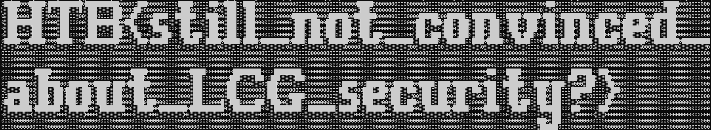

# Extrafiltred Entropy - Writeup

The challenge contains the encryption code & a wireshark recording. In the wireshark recording, messages from the server to the client can be found:

```json
{"init": false, "cmd": "ocXzAq8Q"}
{"init": true, "id": "eba14c429a64b2251717da016e096091", "cmd": "kn4="}
{"init": true, "id": "efbb599758d1743333e5b43ac3e4e2b2", "cmd": "2ulbTirRTzn+EKa1bvu3"}
{"init": true, "id": "79f5d45d89a17c81d9137e0481d59465", "cmd": "B3ljT4UTIVliEXzIoq8="}
{"init": true, "id": "8829affbed23334d34016095627ba065", "cmd": "4FfTtXHCD3LuRRJzLIzwyeylqqGwyTiugfjOo+MbNhyKv1ZDgSL33Lwaysu+dlONfwJ8jaqbuTVnVqwFloEI4wGdC9FFkmJgLpV9y3AZyjM0wsV+DRVR1cpOBvQqT4F46j2JiDxvABDqHRw5yrmv+uByJMyX/cZM2azJMonAVwV95ncUg0uWs3bmpturCW9sWiVaQ2pqjgAuUDs3Yab1/jJa4tthhkJrBJl6cyX88ijWqoMBKUkjsZ/sNa8uGLpC9gGpafUQwfyaPfImxIx8taB8bain59NlaI2RaL3YFfRrkxQAw8rUshLbxqI/AhpOH9LRQ09GeORcBnHPC0HaqMFDgp0euCJzrnVhdDmPrPPGhq/MsfISmr3R94HfOE4hs/h4ceMywp+qHOLZ/1RlvVoSBrK5w7o4G16PJLC9Xf8UzC6rQO5PQBiOcpNgCPg7NvToEickQd7CTBWQOEy+Rv0ar8gnTAooy2cjMe2iqeuEMTOd5Pz8QKS721vcxU4AU4cLDbwhr4tKteb3v3oGcAEiPF9sSoMbBlhoE0m7+f8wLPHvXrgfShSKBD0L9vccz42AMCUZGu+Ctw2QASe5apAnvWz0c+u3rD3aG8aXZo+hF3K4u7rjRkulqm2B+mD9aeJiVb2zlah74L6iRW0MUR7PvXkXSnnaX2sW8E9Y3obSBo2gEqcQAqhLAlsu7Y3y9Jyc87LJEMSf/tmq/BBEFIjcXXWBBO3ys1rK3vFdb5pfND6ApIO/AEhRoguD/SDGCpkOqkjXYk8cgSWaTE3aMULyhCZwFlHsyVMS9CodoFvAbInIEjE+L8ptHDff6IbbkENz/83i7SOGitFn3epsL0fyQjWlA5CSdceb/opVJVUeVwdYbVO4DC9XTRtDivq3VkbI0WL3cHUqmXcmAKzcGMSV/xkMB2Th6vAq+xcYhhm8EoFxqXC14e00/0XlvXm0pkZngfmo0Gd0qqJYofA34HS/Miuy6deJd5u3mnMeUGsv6O9mZ3VlpAUTQtEJXJvbzXbB7j+VPhb3J2JRRs+a9N2Is8jyyRO3tI7kmskDPRyMx1pg4jH138wWyqOvfWXVcTE+qNa+gh4VUZkDsaNE9H2+E/dyx2tKH78htEtT0zkU5tIOCzFl19odAJUdGapWjjqZmEBYKzGIdRF53KLK9qdmPczHycB8uYqRdNbLZixO2lIshAmGh1yx8ZKVGD1/RgFdPiE9k1YxHGQXd5Lmvg=="}
{"init": true, "id": "1680383308c87fc16900ba6808998e03", "cmd": "kg4kSA=="}
```

Each contains the encrypted and base64 encoded command and a `uuid` after initialization. The encryption is an XOR cipher with mutating key, known as **LCG**. A forward step is calculated like:

$state~=~(a⋅state+b)\mod m$

After each encryption of a character, a forward step is executed, resulting in a new `state`. After encryption of a message, another forward step is executed and the resulting `state` is saved as the `uuid`. As decryption is symmetric to encryption, the initial state is required for decryption. To calculate back to the initial state, the following formula can be used:

$prev\_ state~=~((state−b)⋅a^{−1})\mod m$

That way the initial state (`SEED`) of a message can be calculated by going $message\_ length + 1$ steps backwards, as the generation of the `id` is an additional step. The following python code calculates the `SEED` for the long message (message length 928):

```python
a = 0xa1d41ebef9c575ac113fcfd5ac8dbda9
b = 0x8dcf3cf766e0b6c30e753416a70e2367
m = 0x100000000000000000000000000000000

def steps(state: int, steps: int) -> int:
    for _ in range(steps):
        state = (a * state + b) % m
    return state

def mod_inverse(a, m):
    """Calculate the modular multiplicative inverse of a modulo m."""
    m0, x0, x1 = m, 0, 1
    while a > 1:
        q = a // m
        m, a = a % m, m
        x0, x1 = x1 - q * x0, x0
    return x1 + m0 if x1 < 0 else x1

def reverse_steps(state: int, steps: int) -> int:
    for _ in range(steps):
        a_inv = mod_inverse(a, m)
        state = ((state - b) * a_inv) % m
    return state

print(reverse_steps(0x8829affbed23334d34016095627ba065, 929))
```

Knowing the `SEED`, decryption is very easy, as the XOR cipher is symmetric:

```python
from base64 import b64decode as bd, b64encode as be

# The parameters from the server and client code
a = 0xa1d41ebef9c575ac113fcfd5ac8dbda9
b = 0x8dcf3cf766e0b6c30e753416a70e2367
m = 0x100000000000000000000000000000000

SEED = 220418810232715102895007205431999055854

class LCG:
    def __init__(self):
        self.state = SEED
        self.a = a
        self.b = b
        self.m = m
    
    def _next(self):
        self.state = (self.a * self.state + self.b) % self.m
        return self.state
    
    def generate_key(self, l):
        return bytes([self._next() & 0xff for _ in range(l)])

    def generate_packet_uuid(self):
        return hex(self._next())

    def encrypt(self, msg):
        key = self.generate_key(len(msg))
        return bytes([m ^ k for m, k in zip(msg, key)])

    # XOR is symmetric, so decrypt is the same as encrypt
    def decrypt(self, msg):
        return self.encrypt(msg)  

# Simulate receiving an encrypted response (Base64)
enc_response = "4FfTtXHCD3LuRRJzLIzwyeylqqGwyTiugfjOo+MbNhyKv1ZDgSL33Lwaysu+dlONfwJ8jaqbuTVnVqwFloEI4wGdC9FFkmJgLpV9y3AZyjM0wsV+DRVR1cpOBvQqT4F46j2JiDxvABDqHRw5yrmv+uByJMyX/cZM2azJMonAVwV95ncUg0uWs3bmpturCW9sWiVaQ2pqjgAuUDs3Yab1/jJa4tthhkJrBJl6cyX88ijWqoMBKUkjsZ/sNa8uGLpC9gGpafUQwfyaPfImxIx8taB8bain59NlaI2RaL3YFfRrkxQAw8rUshLbxqI/AhpOH9LRQ09GeORcBnHPC0HaqMFDgp0euCJzrnVhdDmPrPPGhq/MsfISmr3R94HfOE4hs/h4ceMywp+qHOLZ/1RlvVoSBrK5w7o4G16PJLC9Xf8UzC6rQO5PQBiOcpNgCPg7NvToEickQd7CTBWQOEy+Rv0ar8gnTAooy2cjMe2iqeuEMTOd5Pz8QKS721vcxU4AU4cLDbwhr4tKteb3v3oGcAEiPF9sSoMbBlhoE0m7+f8wLPHvXrgfShSKBD0L9vccz42AMCUZGu+Ctw2QASe5apAnvWz0c+u3rD3aG8aXZo+hF3K4u7rjRkulqm2B+mD9aeJiVb2zlah74L6iRW0MUR7PvXkXSnnaX2sW8E9Y3obSBo2gEqcQAqhLAlsu7Y3y9Jyc87LJEMSf/tmq/BBEFIjcXXWBBO3ys1rK3vFdb5pfND6ApIO/AEhRoguD/SDGCpkOqkjXYk8cgSWaTE3aMULyhCZwFlHsyVMS9CodoFvAbInIEjE+L8ptHDff6IbbkENz/83i7SOGitFn3epsL0fyQjWlA5CSdceb/opVJVUeVwdYbVO4DC9XTRtDivq3VkbI0WL3cHUqmXcmAKzcGMSV/xkMB2Th6vAq+xcYhhm8EoFxqXC14e00/0XlvXm0pkZngfmo0Gd0qqJYofA34HS/Miuy6deJd5u3mnMeUGsv6O9mZ3VlpAUTQtEJXJvbzXbB7j+VPhb3J2JRRs+a9N2Is8jyyRO3tI7kmskDPRyMx1pg4jH138wWyqOvfWXVcTE+qNa+gh4VUZkDsaNE9H2+E/dyx2tKH78htEtT0zkU5tIOCzFl19odAJUdGapWjjqZmEBYKzGIdRF53KLK9qdmPczHycB8uYqRdNbLZixO2lIshAmGh1yx8ZKVGD1/RgFdPiE9k1YxHGQXd5Lmvg=="
lcg = LCG()

# Decode from Base64
enc_out = bd(enc_response)
# Message length for SEED calculation
print('message length:', len(enc_out))

# Decrypt with the LCG
decrypted_data = lcg.decrypt(enc_out)
print(decrypted_data.decode())
```

The result is the following command:

```bash
echo "H4sIAAE4/WYAA+1YOXLDMAzs9Ro+My0bPzAvyYwnlsjF7gKkncJJOGoIgMDipKT2efsYn9YaUmAfn4LEfcG2EVsgNvOiRrMogvW1okCaPD5v/f6MQZ4pj00HxkxRLNR+QukjuiB10roA1Ikzyvcl8UxNz0WNyaPFeMyuIaldMVCnHkH9tg2pVmWPUl3uRsd0FzGqaTmtckUXFbf7dSeqRJdpZzNGOz2J3T/w5p6ZepJVZinvor1ZRM2IuFDw9GOXe53y2FP7smsbDF0belpmtcFPAoVlcKRre9WpQK6LZCOVMXX3mn6BlfIu2QQ8U1QNHFEBaaIpgeCPCXftvhO0V2adqHXNt2VLmNvKPcdzVUQ587ELkVIgxYeManV30WmAhMW95EVBYn4FWUmZtmKdkqPSv1U8jUox8lif7/BnHbZIKZDiM9/+nRxoVDUSFveSl1qqIiooyQT3YrzjTpFYiOXR/sL69/L3rNFLMpL5soKK6S6znL275rvPqhW26zCGWD5GQiGURlAxwy3Yg2RBZHexKZmHFO0DJTN6yL8EPdJpujEshVeMAIz5OhOmu0YweIAM6he5Eo7V/l1FfZD/QVs5oUe8R2c1YIwAoeV0yeEGxUlRz5kVredbCABFyotcWThKHLcmzK+3lRlCOzbkNyZbuy3RSkS7WSWuD4I4cfQQ4smw37GlI9nPi7yfzk8P2g0xl7LEfjSbLK8xgQyVazxXxnQkiQCi0oJ7DHzF/UzldLFEr2hOaS0T45HBz4nuyPj+1c/wEjhlXBsYdAy2gxPk2RiSAZSqRy1zy1feZ+duuB7NUH8MzAHk+Z8JhmcglLBs2Fb+LgaByDJaRaWaC7D1eX+nBb1XLW5Yb+Uz5Hrb6ffyWjTV2voCIBKnivUiAAA=" | base64 -d | gunzip
```

Executing that command displays the flag as ASCII-art in the terminal:



and can be written as:

```
HTB{still_not_convinced_about_LCG_security?}
```