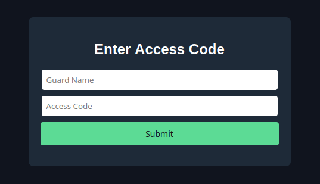

# SecurityInFront - Writeup

The "SecurityInFront" challenge consists of a single HTML file containing
some heavily obfuscated code used for password verification.
This file is called `index.html` and contains a login form as well as the
aformentioned verification.

```bash
# View index.html in your browser
firefox index.html
```



All the magic happens in what is initially a single line of code.
Said line is part of the function `checkCredentials()`, which is called once the user submits their username and activation code.


Ok, this is initially not very helpful. Logically, the first step is to perform some basic cleanup work on the code.
Adding newlines and proper indentation already helps in a major way. For clarity, the following source code has been shortened slightly.
Important sections of code will be shown and explained when necessary. To keep the content concise, the 'if' operation has been cut from the function.
It will be discussed in a moment.

```js
async function checkCredentials() {
    var t = document.getElementById("access-user").value,
        r = document.getElementById("access-code").value;
    var c1 = "NOPQRSTUVWXYZABCDEFGHIJKLMnopqrstuvwxyzabcdefghijklm",
        c2 = "ABCDEFGHIJKLMNOPQRSTUVWXYZabcdefghijklmnopqrstuvwxyz",
        n1 = [5,6,7,8,9,0,1,2,3,4],
        n2 = "0123456789";
    var n = (e,t,r)=>e.reduce(((e,r,n)=>r.apply(e,t[n])),r),
        c = [""],
        i = String.prototype.split,
        a = Array.prototype.join,
        o = Array.prototype.filter,
        p = Array.prototype.map,
        l = String.prototype.slice,
        y = String.prototype.repeat,
        u = Array.prototype.indexOf,
        s = Array.prototype.reduce,
        d = Array.prototype.reverse,
        h = function(e) {return this==e},
        f = function(e) {return indexedDB.cmp(this,e)},
        A=String.prototype.charAt;

        if( /* Operation cut for readability */ ){
            var v = new Uint8Array((new TextEncoder).encode(r)),
                g = new Uint8Array(await crypto.subtle.digest("SHA-256",v)),
                m = new Uint8Array([9,87,39,96,151,202,140,186,120,235,167,229,47,231,6,212,77,205,58,14,248,104,169,79,116,140,236,98,126,26,100,120]);

            0 == indexedDB.cmp(g,m) ? activate() : alert("User is not authorized. This incident will be reported.")
        }else alert("User is not authorized.")
}
```

As can be seen here, there are a whole bunch of functions being assigned to single letters. This is an important step in the obfuscation process.
Other then that, two different alphabets `c1` and `c2` are defined, with corresponding digit lists `n1` and `n2`.
Then, it is important to remember that the user supplied username is stored in the variable `t` and the password / activation code in the variable `r`.
Last, there is the variable `n`, which is a particularly different function declaration compared to the other ones.

Here's a quick breakdown of this function. Understanding it is necessary, as `n` is the core of the entire credential verification process.
Generally, `n` is an anonymous function that takes the three parameters `e`, `t` and `r`. It then calls `reduce()` with `e`.
This reduce function contains *another* anonymous function. The parameters used by this internal call are **not the same** as the outer ones, despite sharing
the same name. They are overwritten by `reduce()`! A bit of refactoring will make this more clear.

```js
var n = (e, t, r) => {
    e.reduce((
        (a, b, c) => {
            b.apply(a, t[c])
    }), r)
};
```

The code is still relatively difficult to interpret, but let's leave it at that for now.
Looking at the 'if' operation will make it easier to understand.

To keep it readable, some pseudo-code will be used to describe the structure of said operation.
In a very simple way, it is made up of a single array with yet another `reduce()` call.

```js
if ([/*fields*/].reduce(((e, t) => e && n.apply(void 0, t)), !0)) {
    /*... more code ...*/
}
```

There are some uncommon statements in there, but they can easily be converted in more well-known types.

```js
if ([/*fields*/].reduce(((e, t) => e && n.apply(undefined, t)), true)) {
    /*... more code ...*/
}
```

Ok, let's take a look at `reduce()` now.
This function takes two parameters:

1. A callback function that is executed on each element of the array. This function passes its return value on to the next callback call.
2. The initial value to start from. The first callback function call has no return value from a previous call, so it is set manually.

A great resource to understand and experiment around with this statement can be found [here (developer.mozilla.org)](https://developer.mozilla.org/en-US/docs/Web/JavaScript/Reference/Global_Objects/Array/reduce).

In case of the challenge, the initial value is `true`, which is equivalent to the number 1.
The callback function uses the parameter `e`, which contains the return value of the previous function call,
and `t`, which is the current element from the array.

Everything that this callback does is to check whether both `e` and `n(t)` are bigger then zero, or `true`.

That is still pretty confusing, so let's now inspect what `t` actually is.
The array formerly written down as `[/*fields*/]` is a 4-dimensional array with a very specific structure.

As this is easier when vizualised, the arrays structure looks like this:

```
[
    [
        [a, b, c],
        [x, [y, z]],
        r
    ],
    [...],
    [...],
]
```

An important feature of this array is, that the second dimension *always* contains exactly 3 elements!
This is necessary, because when `n.apply(undefined, t)` or in a more simple manner `n(t)` is called,
`t` is an array of 3 elements, which can then populate the parameters `n(e, t, r)`.

As an example, when called on the above depiction of the array, the function call would look like this:

```js
n([a, b, c], [x, [y, z]], r);
```

From everything learned so far, it can be concluded that the array `[/*fields*/]` contains a bunch of individual boolean-operations that all need to be true in
order to pass the password check. However, it is not yet known how these operations work exactly.
As alogical as it is, the most simple one of them is actually the last.

This array entry / operation is noted down like this:

```js
if([
/*other operations*/
[
    [A, h],
    [
        [6],
        ["0"]
    ],
    r
]
].reduce(((e, t) => e && n.apply(undefined, t)), true)))
```

Essentially, this translates into a call to `n` that looks like below:

```js
n.apply(undefined, [[A, h], [[6], ["0"]], r])
```

Since the letters `A` and `h` are mapped to their own functions (see very first listing),
the statement can be expanded even further. One should also remember that the letter `r` contains the password
provided by the user. Because of this it has been renamed to `r-password`.

```js
n.apply(undefined,
    [
        [String.prototype.charAt, function(e) {return this==e}],
        [
            [6],
            ["0"]
        ],
        r-password
    ]
)
```

The previously explained function `n(e, t, r)` will now used yet another `reduce()` to iterator over all the functions in the
first subarray and execute them on `r-password` with the corresponding element from the second subarray as it's parameters.

Since this one operation is relatively simple, it is possible to explain it on a step by step basis in a timely manner.

First, `n()` is called with the array `t`. This triggers another reduce that takes the `r-password`, the and the first elements of each subarray to construct the following function call:

```js
/*
Reminder:
var n = (e, t, r) => {
    e.reduce((
        (a, b, c) => {
            b.apply(a, t[c])
    }), r)
};
*/
String.prototype.charAt.apply(r, [6]);
```

Since this is executed in the context of a `reduce()` call, the return value of the above line is then passed on to the next function call.
While the second function is a custom on in this case, it still works the same. The return value of the previous function, refered to as `a`
will become the value `this` of the custom function due to the nature of Javascript. The new `e` will have the value `"0"`.

```js
// a = String.prototype.charAt.apply(r, [6])
return a == e;
```

As that is the last statement, that is also what will be returned by `n.apply()`.
In turn, it can be deducted that the 6th character (counted from 0) of the password has to be the a "0".


Since it is now known how the evaluation process works, it is possible to quickly construct a chain of transformations and comparisons from the other root element entries.
For each subelement, there will be a comment giving a short insight into what each line results in.

The first `t` element is this:

```js
[
    // Functions, in that order:
    // split, map, return this == e, return indexedDB.cmp(this, e)
    [i, p, f, h],
    [
        // since c = "" -> t.split("")
        c,

        // Because of the way the two alphabets c1 & c2 are set up,
        // this is a Rot13 operation on t
        // Note that u = Array.prototype.indexOf
        [e => -1 == u.call(c2, e) ? e : c1[u.call(c2, e)]],

        // After being rotated,
        // t is compared to this character set.
        [["n", "q", "z", "v", "a"]],

        // When all characters are equal in the previous function,
        // only zeros are returned. This statement will then
        // return true because 0 == 0
        [0]
    ],
    t // The username
]
```

The string "nqzva" can now simply be rotated again (see [Cyberchef - Rot13](https://gchq.github.io/CyberChef/#recipe=ROT13%28true%2Ctrue%2Cfalse%2C13%29%26input%3DbnF6dmE%26oenc%3D65001)).
As a result, the attacker learns that the username is supposed to be "admin".

The next `t` object is:

```js
[
    // Functions, in that order:
    // slice, repeat, split, map, filter, return this == e, return indexedDB.cmp(this, e)
    [l, y, i, p, o, f, h],
    [
        // Get the first 4 elements of the password
        // r.slice(0, 4)
        [0, 4],

        // Repeat this 4 letter string 3 times
        // E.g. "abcd" -> "abcdabcdabcd"
        // "abcd".repeat(3)
        [3],

        // Split the string into characters
        // c = "" -> "abcdabcdabcd".split("")
        c,

        // Same as in the previous block, use Rot13 on the 
        // trippled and then split string
        [e => -1 == u.call(c2, e) ? e : c1[u.call(c2, e)]],

        // This shifts the characters around and removes the tripplets
        // ["a", "b", "c", "d", "a", "b", "c", "d", "a", "b", "c", "d"].filter((e, t) => t % 3 == 1)
        // becomes
        // [ "b", "a", "d", "c" ]
        [(e, t) => t % 3 == 1],

        // Compare the new array to this array
        [["G", "U", "{", "O"]],

        // Same as before, if all characters of the previous array are equal,
        // only zeroes will have been returned, hence this comparison will be true.
        [0]
    ],
    // Password
    r
]
```

It is now known that the first 4 elements of the array have to be "HTB{".
This makes sense, as that is usually how HTB flags start.

The next `t` element is:

```js
[
    [
        l, // slice
        function() {return encodeURI(this)}, // Well, encodeURI
        l, // slice
        function(e) {return parseInt(this, e)}, // parseInt
        function(e) {return this ^ e}, // XOR
        h // return this == e
    ],
    [
        // Get the very last character of the password
        // r.slice(-1)
        [-1],

        // URI encode the last character of the password
        // This will result in a three letter string like "%XX"
        // encodeURI(r.slice(-1))
        [],

        // Drop the "%" from the URI encoded letter
        // "%XX".slice(-2) -> "XX"
        [-2],

        // Parse the URI encoded character into an integer.
        // This works as URI encoded characters are just
        // one way to write hex-encoded text.
        // parseInt("XX", 16)
        [16],

        // XOR the integer with 96
        // parseInt("XX", 16) ^ 96
        [96],

        //Check whether the result of the XOR operation is 29
        [29]
    ],
    // Password
    r
]
```

Using Python or Cyberchef, the XOR calculation can simply be reversed.
This results in the number `125`, which is the charcode for "}".
Once again that makes sense, as that is how HTB usually closes its flags.

```python
chr(29 ^ 96)
```

The next `t` element looks like this:

```js
[
    // Functions, in this order:
    // split, reduce, return this == e
    [i, s, h],
    [
        // Turn the password into an array
        // r.split("")
        c,

        // Call reduce on the password array.
        // This will perform the calculation
        // 2^password_length
        [e => e + e, 1],

        // Confirm the the result of 2^password_length
        // is 16777216
        [16777216],
    ],
    // Password
    r
]
```

The above block can be used to calculate the flag length, it's 24 characters.
This knowledge will come in handy for the next `t`.

This is officially the half-way-point!
The next `t` is:

```js
[
    // Functions, in this order:
    // repeat, split, map, reduce, return this == e
    [y, i, p, s, h],
    [
        // Repeat the password 21 times
        // r.repeat(21)
        [21],

        // Turn the now really long password into an array
        // r.repeat(21).split("")
        c,

        // This is the same as the previous mappings using c1 & c2,
        // but this time for numbers instead of letters.
        [e => n1[u.call(n2, e)]],

        // This one is a bit more complex.
        // It iterates of the long array and adds 1
        // when the character is 8 but does nothing if it is not.
        [(e, t) => e + h.apply(t, [8]), 0],

        // Returns true when the result of the
        // previous reduce call is 63.
        [63]
    ],
    // Password
    r
]
```

This statement is likely the most difficult one to properly use out of the whole bunch.
First: when 8 is rotated again, it turns into a 3.
Second: Out of a array with `21 * 24 = 504` elements, there are 63 "3"-s.
This means that the original password contains `63 / 21 = 3` "3"-s.
So far it is unknown where in the flag they belong, but this
fact can be remembered for later.

The next `t` is:

```js
[
    // Functions, in this order:
    // split, filter, map, reverse, join, return this == e
    [i, o, p, d, a, h],
    [
        // Split the password into an array, common procedure by now
        // r.split("")
        c,

        // This grabs the characters at the indices 4, 11, ...
        // from the password array
        [(e, t) => ~u.call([4, 11, 13, 14, 16, 17, 20, 22], t)],

        // Perform a Rot13 operation on the grabbed characters
        [e => c1[u.call(c2, e)]],

        // Reverse the rotated array
        [],

        // Join the array back into a string
        // using "-" as a separator
        ["-"],

        // Compare the final result to the string below
        ["E-X-U-P-J-C-Q-S"]
    ],
    // Password
    r
]
```

This block lets the attacker know the exact characters for the indices 4, 11, 13, 14, 16, 17, 20 and 22. The string "E-X-U-P-J-C-Q-S" simply needs to be reversed and rotated. The result is
the new string "F-D-P-W-C-H-K-R", which, when combined with the other knowledge collected thus
far, produces this partial flag: `HTB{F______D_PW_CH__K_R}`.

The next `t` looks like this:

```js
[
    [
        function() {return Array.from(this)}, // Creates an array from 'this'
        f, // return indexedDB.cmp(this, e)
        h // return this == e
    ],
    [
        // Creates an array from the password
        // Array.from(new Set(...))
        [],

        // When the array is just ["_"], return true
        ["_"],

        // If all previous characters matched, set the final result to true
        [0]
    ],
    new Set(
        n(
            // Funcitons, in this order:
            // slice, split, reverse, filter
            [l, i, d, o],
            [
                // Select the password characters at the
                // indices 12 to 15
                // r.slice(12, 16)
                [12, 16],

                // Create an array from the substring
                // r.slice(12, 16).split("")
                c,

                // Reverse the array
                [],

                // Grabs the characters at the indices 0 and 3
                // from the reverse array
                // Translates to the 12th and 15th character
                // of the original password string
                [(e, t) => ~u.apply([0, 3], [t])]
            ],
            // Password
            r
        )
    )
]
```

That one is interesting, but not much more difficult to reverse once the attacker
understands that the `n` call in `new Set()` is executed before the rest of the block.
To explain it once again in short: the above block checks whether the 12th and 15th character
of the password / flag are the character "_".

The next `t` element is:

```js
[
    [
        i, // split
        d, // reverse
        o, // filter
        function() { // move the first two characters of the input to its end
            return this.slice(2, this.length)
                       .concat(this.slice(0, 2))
        },
        d, // reverse
        a, // join
        h // return this == e
    ],
    [
        // Split the password into an array
        // r.split("")
        c,

        // Reverse the array
        // r.split("").reverse()
        [],

        // Grab the characters at the indices 4, 13, 15, 16, 18
        // from the reverse array.
        // Note that they do stay in the correct order by index!
        // ["a", "b", "c", "d"].filter((e, t) => Array.prototype.indexOf.apply([1, 0, 2], [t]))
        // == ["a", "c", "d"]
        [(e, t) => ~u.apply([18, 13, 4, 16, 15], [t])],

        // Move the first two characters of the new array to the back of it
        // E.g. "abcde" -> "cdeab"
        [],

        // Reverse the new array again
        [],

        // Join the array into a string
        [""],

        // Compare the result of the previous operation to this string
        ["ncrnt"]
    ],
    r
]
```

There are a lot of reverses and shift operations in this block,
but it can still be calculated in reverse:

1. Reverse "ncrnt" to "tnrcn"
2. Move the last two characters to the front: "cntnr"
3. **Don't** reverse it a second time, since the characters have been read from the flag in reverse already
4. Keep the order in mind when appling it to the flag.

```
4  -> c
13 -> n
15 -> t
16 -> n
18 -> r
```

Now the characters can be applied to the flag back to front like this:

```
321098765432109876543210 (reversed index)
HTB{Fr0nt nD_PW_CH cK R}
```

Conveniently, there are only three characters missing.
From one of the previous `t` elements it is known that the flag
contains three "3" characters. These can now be inserted to assemble the full flag.

```
HTB{Fr0nt3nD_PW_CH3cK3R}
```

It can be verfied by attempting to use this flag as the password for the "admin" account.
And indeed, a login is possible!
